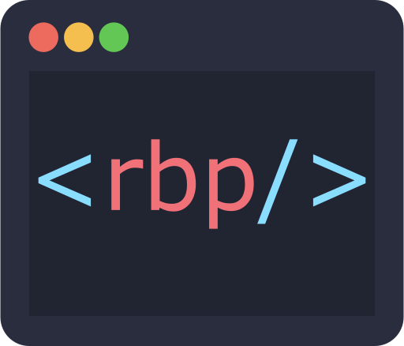

<h1 align="center">
	 
	 
    <a href="http://responsivebp.com">Responsive Boilerplate</a> 
	 
</h1>

## A powerful, accessible, developer friendly, framework for building responsive websites

### Responsive BP is the developers' framework.

Other frameworks are too design opinionated and heavy. They're great for prototyping but every time
you start a real, front-facing, project with them you have to overwrite lots of designer styles that do nothing to add to the
functionality of the website. That costs developers time and money.

**Responsive BP** has been built with that in mind. It is the result of thousands of hours of real, client driven web development and
testing; specifically developed to be as lightweight as possible to prevent the need to undo styles set by the framework itself
and allow developers to write efficient code and lower costs.
  
**Responsive BP is tiny**. The combined output CSS and JavaScript is **only 20.3kb minified and gzipped** but there is a lot of functionality built into the framework with touch, right-to-left language, and accessibility support. 

Browser support covers all evergreen browsers.

## Downloading Responsive BP

Several options are available for downloading Responsive:

- [Download the latest release](https://github.com/ResponsiveBP/Responsive/releases/download/4.1.4/responsive.zip).
- [Download the latest release source](https://github.com/ResponsiveBP/Responsive/archive/4.1.4.zip).
- Clone the repo: `git clone https://github.com/ResponsiveBP/Responsive.git`.
- Install with [NPM](https://www.npmjs.com/package/responsive-bp): `npm install responsive-bp`.

## Documentation

Responsives' documentation, included in the [gh-pages](https://github.com/ResponsiveBP/Responsive/tree/gh-pages) repo. It is built with [Jekyll](http://jekyllrb.com) and publicly hosted on GitHub Pages at [http://responsivebp.com](http://responsivebp.com). The docs may also be run locally.

1. If necessary, [install Jekyll](http://jekyllrb.com/docs/installation) (requires v2.5.2).
 - **If you are running Windows** please read this [unofficial guide](https://github.com/juthilo/run-jekyll-on-windows/) to get Jekyll up and running without problems.
2. From the root `/Responsive` directory, run `jekyll serve` in the command line.
 - Open [http://localhost:4000](http://localhost:4000) in your browser to view the compiled docs.

Learn more about using Jekyll by reading its [documentation](http://jekyllrb.com/docs/home/).

## Contributing

Contribution is most welcome, that's the whole idea! Together as a community we can build a boilerplate for building 
responsive sites that will ensure that high standards can be delivered across all devices.   

Please adhere to existing JavaScript and Sass styles though when submitting code and ensure 
that you test thoroughly on multiple devices.

Please take a moment to review the [guidelines for contributing](CONTRIBUTING.md).

* [Bug reports](CONTRIBUTING.md#bugs)
* [Feature requests](CONTRIBUTING.md#features)
* [Pull requests](CONTRIBUTING.md#pull-requests)

## Building the Sass and JavaScript

The build process for Responsive is powered by [Webpack](https://webpack.js.org/). To build Responsive you will need to first install the required plugins using the following commands from the root `/Responsive` directory:

1. `npm install` to install the necessary build dependencies based on the contents of the `package.json` file.

If you are adding new functionality to the build process use:

    npm install {your_new_build_dependency} --save-dev

There are three types of build available:

 1. `npm run build` Compiles the framework to the **dist** folder.
 2. `npm run dev` For development purposes. Compiles the framework to the **dist** folder and watches for further changes

## Authors

James South [@james_m_south](http://twitter.com/james_m_south) and the Responsive contributors.

## Community

Follow [@responsivebp](http://twitter.com/responsivebp) on Twitter.
Discuss Responsive on [Gitter](https://gitter.im/ResponsiveBP/Responsive).

### Copyright and license

Copyright 2013-2017 James Jackson-South under the [MIT license](http://opensource.org/licenses/MIT).
